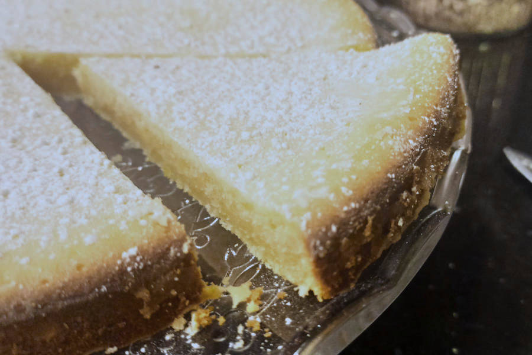

## Citronkladdkaka
__Quelle und weitere Informationen: https://github.com/OMerkel/recipes __

Zum https://omerkel.github.io/recipes/[__Rezepte-Index__ pass:[&#x1F372;]]

### Zutaten

[%interactive]
* [ ] 175 g Butter
* [ ] 2 Zitronen in Bioqualität
* [ ] 3 mittelgroße Eier
* [ ] 150 g Zucker
* [ ] 150 g Mehl
* [ ] 1 TL Vanillezucker

### Zubereitung

[%interactive]
* [ ] Butter schmelzen. Gewaschene Zitronenschale reiben und Saft auspressen.
* [ ] Zucker, Vanillezucker und Eier gemeinsam schaumig schlagen, dann gesiebtes Mehl, Butter, Zitronenschale und den Saft hinzugeben.
* [ ] Mischung in gefettete und gemehlte Springform mit Ø 26cm geben und ca. 30 Minuten im vorgeheizten Ofen bei 150°C backen.
* [ ] Kuchen abkühlen lassen und mindestens eine Stunde in den Kühlschrank geben, bis der Kuchen sich verfestigt hat.

====
*TIPP* _Statt die Springform zu mehlen, diese mit Kokosflocken bestreuen._
====

====
*TIPP* _Abschließend Kuchenstücke mit Puderzucker bestreut dekorieren und Schlagsahne hinzugeben._
====
