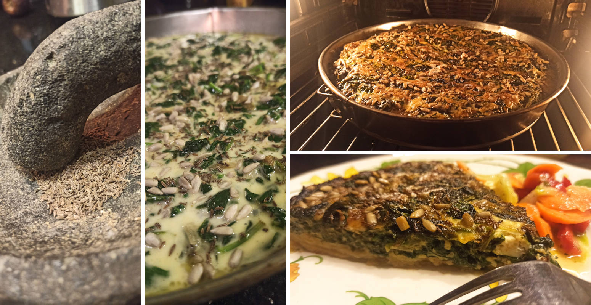

## Spinatkuchen
__Quelle und weitere Informationen: https://github.com/OMerkel/recipes __

Zum https://omerkel.github.io/recipes/[__Rezepte-Index__ pass:[&#x1F372;]]

### Zutaten
Für den Teig

[%interactive]
* [ ] 400 g gekochte Kartoffeln vom Vortag
* [ ] 75 g Weizenmehl
* [ ] 1/2 TL Salz
* [ ] 1/2 TL geriebene Muskatnuss
* [ ] etwas gemahlenen Pfeffer
* [ ] 2 EL Fett

Für den Belag

[%interactive]
* [ ] 1 mittelgroße Zwiebeln
* [ ] 1 TL Butter/Margarine
* [ ] 300 g Blattspinat
* [ ] 200 g Gorgonzola
* [ ] 200 g Schlagsahne
* [ ] 2 mittelgroße Eier
* [ ] 1 TL Kümmel
* [ ] 2 EL Sonnenblumenkerne

### Zubereitung

[%interactive]
* [ ] Geschälte und gekochte Kartoffeln zu Pürre zerdrücken.
* [ ] Mit Mehl, Salz, Pfeffer und Muskat zu glatten Teig kneten.
* [ ] Teig auf gefettetes tiefes Blech oder in Springform verteilen.

[%interactive]
* [ ] Zwiebeln schälen und wahlweise in dünne Ringe, Streifen oder kleine Würfel schneiden und glasig in Butter andünsten.
* [ ] Spinat grob hacken, dann zugeben und kurz weiter mitdünsten.
* [ ] Sahne erhitzen und Gorgonzola darin schmelzen, dann abkühlen lassen.
* [ ] Verquirlte Eier darin unterrühren, Kümmel und Spinat zugeben, verrühren, dann auf Teig verteilen.
* [ ] Mit Sonnenblumenkernen bestreuen.
* [ ] Im vorgeheizten Ofen ca. 50 Minuten bei E-Herd 200 °C / Umluft 175 °C backen.

====
*HINWEIS* _Um den Bräunungsgrad der Kuchenoberfläche herabzusetzen, kann der Kuchen
nach halber Backzeit mit Butterbrotpapier abgedeckt werden. Alternativ die Backtemperatur
etwas verringern oder auf Oberhitze verzichten._
====
